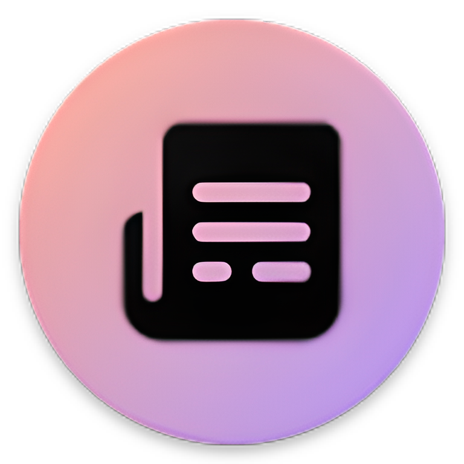

<a name="readme-top"></a>

<!-- PROJECT LOGO -->
<br />
<div align="center">
  <a href="https://github.com/2dgirlismywaifu/NewsAPP_RSS_NewsAPI_Azure">
    
  </a>

<h3 align="center", style="font-size:40px">NewsApp Reader</h3>
<p1 align="center", style="font-size:20px">Powered by NewsAPI and Microsft Azure Services</p1><br />
  <p2 align="center", style="font-size:20px">
    A News Reader App from multiple sources
  </p2>
</div>
 <hr>

  ![Contributors][contributors-shield]
  [![Forks][forks-shield]][forks-url]
  [![Stargazers][stars-shield]][stars-url]
  ![Reposize][size-shield]
  ![Lastcommit][commit-shield]
  [![Issues][issues-shield]][issues-url]
  [![APACHE License][license-shield]][license-url]

  <div align="center">
    <p align="center">
    <a href="https://github.com/2dgirlismywaifu/NewsAPP_RSS_NewsAPI_Azure", style="font-size:20px"><strong>Explore the docs »</strong></a>
    <br />
    <a href="#demo">View Demo</a>
    ·
    <a href="https://github.com/2dgirlismywaifu/NewsAPP_RSS_NewsAPI_Azure/issues">Report Bug</a>
    ·
    <a href="https://github.com/2dgirlismywaifu/NewsAPP_RSS_NewsAPI_Azure/issues">Request Feature</a>
    </p>
  </div>
<!-- TABLE OF CONTENTS -->
<details>
  <summary>Table of Contents</summary>
  <ol>
    <li>
      <a href="#about-the-project">About The Project</a>
      <ul>
        <li><a href="#include-with-project">Include with project</a></li>
      </ul>
    </li>
    <li>
      <a href="#getting-started">Getting Started</a>
      <ul>
        <li><a href="#prerequisites">Prerequisites</a></li>
        <li><a href="#installation">Installation</a></li>
      </ul>
    </li>
    <li><a href="#demo">Demo</a></li>
    <li><a href="#known-issues">Known Issues</a></li>
    <li><a href="#contributing">Contributing</a></li>
    <li><a href="#license">License</a></li>
    <li><a href="#contact">Contact</a></li>

  </ol>
</details>


<!-- ABOUT THE PROJECT -->
## About The Project

News application or newspaper reading application is a popular application with the role of providing quick news to users. In this project, the application uses: NewsAPI with 53 countries supported, RSS2JSON converts RSS to JSON and Microsoft Azure services: SQL Server, App Services and Blob Storages.

[![Product Name Screen Shot][product-screenshot]](https://github.com/2dgirlismywaifu/NewsAPP_RSS_NewsAPI_Azure)

<p align="right">(<a href="#readme-top">back to top</a>)</p>

## Include with project
* SQL file without include user information
* Figma design file
* Image use in Azure Blob Storage
<p align="right">(<a href="#readme-top">back to top</a>)</p>

<!-- GETTING STARTED -->
## Getting Started

This project only use for research and purpose. It is NOT available for retail. \
Follow all instruction to run project in your local devices.


### Prerequisites

Before use this project, you need have:
* Android Studio
* Android Native Development Kit
* Sign up Free Account Microsoft Azure Portal if you do not have any account
* Create free Azure SQL Database S0: [Free Azure SQL Database](https://learn.microsoft.com/en-us/azure/azure-sql/database/free-sql-db-free-account-how-to-deploy?view=azuresql)
* Create App Services B1 Plan (Recomended: 13$/month): [NewsApp Android RESTServices](https://github.com/2dgirlismywaifu/NewsApp_Android_RESTServices)
* Java Development Kit 17\
Notes: You can use Azure App Services with F1 Plan (Free Forever), but performance is very slow.
### Installation
1. Clone the repo
   ```sh
   git clone https://github.com/2dgirlismywaifu/NewsAPP_RSS_NewsAPI_Azure.git
   ```
2. Follow instruction form my App Services: [NewsApp Android RESTServices](https://github.com/2dgirlismywaifu/NewsApp_Android_RESTServices)
3. Get a free NewsAPI Key at [https://newsapi.org/](https://newsapi.org/)
4. Get a free RSS2JSON API Key at [https://rss2json.com/](https://rss2json.com/)
5. Get a secret access token to Azure Blob Storage follow this link [Create SAS Token Azure Blob Containers](https://learn.microsoft.com/en-us/azure/cognitive-services/translator/document-translation/how-to-guides/create-sas-tokens?tabs=Containers)
6. Open this project in Android Studio
7. Encode all your API key to Base64 (Azure Blob SAS need encode 2 times)
8. Page your encode API key at
    ```
    app\src\main\jni\keys.c
    ```

<p align="right">(<a href="#readme-top">back to top</a>)</p>


## Demo

This is a video demo project


<p align="right">(<a href="#readme-top">back to top</a>)</p>

## Known Issues

1. RecycleView Search only work with RecycleView Horizontal (expect: NewsSourceList, Favourite News).
2. Set favourite an un favourite in recycleview adapter not update view. Need Swipe To Refresh action from user to update view.\
3. ~~Duplicate result login~~
4. Tell me :)\
See the [open issues](https://github.com/2dgirlismywaifu/NewsAPP_RSS_NewsAPI_Azure/issues) for a full list of proposed features (and known issues).

<p align="right">(<a href="#readme-top">back to top</a>)</p>


<!-- CONTRIBUTING -->
## Contributing

Contributions are what make the open source community such an amazing place to learn, inspire, and create. Any contributions you make are **greatly appreciated**.

If you have a suggestion that would make this better, please fork the repo and create a pull request. You can also simply open an issue with the tag "enhancement".
Don't forget to give the project a star! Thanks again!

1. Fork the Project
2. Create your Feature Branch (`git checkout -b feature/AmazingFeature`)
3. Commit your Changes (`git commit -m 'Add some AmazingFeature'`)
4. Push to the Branch (`git push origin feature/AmazingFeature`)
5. Open a Pull Request

<p align="right">(<a href="#readme-top">back to top</a>)</p>


<!-- LICENSE -->
## License

Distributed under the Apache License. See `LICENSE` for more information.

<p align="right">(<a href="#readme-top">back to top</a>)</p>


<!-- CONTACT -->
## Contact

Ngo Thanh Long - [@MyWaifuis2DGirl](https://twitter.com/MyWaifuis2DGirl) - longnt2911workspace@gmail.com

Project Link: [https://github.com/2dgirlismywaifu/NewsAPP_RSS_NewsAPI_Azure](https://github.com/2dgirlismywaifu/NewsAPP_RSS_NewsAPI_Azure)

<p align="right">(<a href="#readme-top">back to top</a>)</p>

<!-- MARKDOWN LINKS & IMAGES -->
<!-- https://www.markdownguide.org/basic-syntax/#reference-style-links -->
[contributors-shield]: https://img.shields.io/github/contributors/2dgirlismywaifu/NewsAPP_RSS_NewsAPI_Azure.svg?style=for-the-badge&color=C9CBFF&logoColor=D9E0EE&labelColor=302D41
[contributors-url]: https://github.com/2dgirlismywaifu/NewsAPP_RSS_NewsAPI_Azure/graphs/contributors
[forks-shield]: https://img.shields.io/github/forks/2dgirlismywaifu/NewsAPP_RSS_NewsAPI_Azure.svg?style=for-the-badge&color=C9CBFF&logoColor=D9E0EE&labelColor=302D41
[forks-url]: https://github.com/2dgirlismywaifu/NewsAPP_RSS_NewsAPI_Azure/network/members
[stars-shield]: https://img.shields.io/github/stars/2dgirlismywaifu/NewsAPP_RSS_NewsAPI_Azure.svg?style=for-the-badge&color=C9CBFF&logoColor=D9E0EE&labelColor=302D41
[size-shield]: https://img.shields.io/github/repo-size/2dgirlismywaifu/NewsAPP_RSS_NewsAPI_Azure.svg?style=for-the-badge&color=C9CBFF&logoColor=D9E0EE&labelColor=302D41
[commit-shield]: https://img.shields.io/github/last-commit/2dgirlismywaifu/NewsAPP_RSS_NewsAPI_Azure.svg?style=for-the-badge&color=C9CBFF&logoColor=D9E0EE&labelColor=302D41
[stars-url]: https://github.com/2dgirlismywaifu/NewsAPP_RSS_NewsAPI_Azure/stargazers
[issues-shield]: https://img.shields.io/github/issues/2dgirlismywaifu/NewsAPP_RSS_NewsAPI_Azure.svg?style=for-the-badge&color=C9CBFF&logoColor=D9E0EE&labelColor=302D41
[issues-url]: https://github.com/2dgirlismywaifu/NewsAPP_RSS_NewsAPI_Azure/issues
[license-shield]: https://img.shields.io/github/license/2dgirlismywaifu/NewsAPP_RSS_NewsAPI_Azure.svg?style=for-the-badge&color=C9CBFF&logoColor=D9E0EE&labelColor=302D41
[license-url]: https://github.com/2dgirlismywaifu/NewsAPP_RSS_NewsAPI_Azure/blob/master/LICENSE
[product-screenshot]: images/screenshot.png
